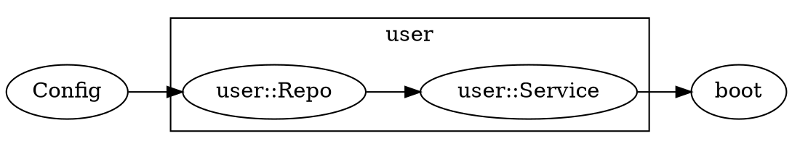

# modrun Roadmap

modrun 是 **Tokio 上的模块化应用组合器**：领域 `Module`、构造函数注入、显式模块边界、
统一生命周期——在组合根一次性接线。核心路线图（Value Groups、Dependency Graph）已交付；
当前重心是 **文档收敛、稳定性、示例**，而不是继续堆 registration API。

> 刻意不做：string qualifier、runtime `get<T>()`、`fx.Annotate` / `fx.Populate`、
> 注解扫描、service locator、全局 singleton、`decorate` 一等 API（用 wrapper 构造函数代替）。
> 详见 README「When not to use this」与 [CONTRIBUTING.md](CONTRIBUTING.md)。

***

## 现状摘要

| 能力 | 现状 |
|------|------|
| Module / Lifecycle / typed wiring | ✅ 完整 |
| DAG 并发构造 | ✅ `container/graph.rs` + `build.rs` |
| 可观测性 | ✅ `trace.rs`，Fx 风格 console + structured fields |
| Value Groups | ✅ v0.2 — `Group<T>` + `provide_group*` / `supply_group` / `require_group` |
| Graph 导出 | ✅ `render_dot()` + `.dot_graph(path)` |
| 横切关注点 | ✅ **文档化** — wrapper 构造函数（`examples/wrap.rs`），无 `decorate` API |
| API 收敛 | 🔄 README 五动词表、CONTRIBUTING 稳定性承诺 |

***

## Phase 1 — 横切关注点（wrapper 构造函数，非 API）

**状态：✅ 以文档与示例交付，不实现 `decorate`。**

### 结论

Fx 的 `Decorate` 在 Rust 里应表达为 **普通 wrapper 构造函数**。每种类型只能 `provide` 一次：

```rust
// 组合根：一个 ctor 内组合
fn app_logger() -> Logger {
    metrics_logger(named_logger(new_logger()))
}
Modrun::builder().provide(app_logger).invoke(boot);

// 模块：私有原始类型 + 公开 newtype / 服务类型
Module::new("http")
    .provide_private(new_client)
    .provide(with_timeout)   // fn(Client) -> HttpClient
    .invoke(register_routes)
```

### 为何不做 `decorate` API

1. 会再复制一整族 sync/async/fallible × module × `_mut` 方法，扩大 Fx 式表面积。
2. wrapper ctor 已是强类型、可测试、IDE 可跳转的 Rust 惯用法。
3. `provide_private` + `provide` 已覆盖模块边界场景。

### 交付物

* \[x] README / README\_zh「横切关注点」节
* \[x] `examples/wrap.rs`
* \[x] CONTRIBUTING「Deliberately rejected」

### 历史设计（仅供参考，不再实施）

<details>
<summary>原 Phase 1 Decorate API 草案（已否决）</summary>

```rust
// 不再计划实现
Modrun::builder()
    .provide(new_logger)
    .decorate(|log: Logger| log.with_name("myapp"))
    .decorate(with_metrics)
    .invoke(boot);
```

</details>

***

## Phase 2 — Value Groups（已完成）

**状态：✅ v0.2 已交付。** 以下保留为设计参考。

### 动机

HTTP middleware、事件 handler、子命令、定时任务、插件路由等场景需要：

```text
Module A → HandlerA ─┐
Module B → HandlerB ─┼→ 聚合 → boot 统一注册
Module C → HandlerC ─┘
```

没有 group，只能手动维护 `Vec` 或在单一模块里注册所有 handler，破坏模块化。

### 目标 API

命名与 `provide` 对称：单例用 `provide_*`，组成员用 `provide_group_*`。
Group 成员仍是「生产一个 `T`」的构造函数，复用现有 `ProviderFn` trait 体系，
只是结果写入 `Group<T>` 的 `Vec`，而非单例槽位。

**注册侧**（`ModrunBuilder` + `Module`）：

```rust
Modrun::builder()
    // 同步 / infallible（T 由返回类型推断，无 turbofish）
    .provide_group(new_user_handler)
    // 同步 / fallible
    .provide_group_result(try_parse_handler)
    // async / infallible
    .provide_group_async(connect_handler)
    // async / fallible
    .provide_group_result_async(connect_handler)
    // 已有实例，跳过构造（测试常用）
    .supply_group(FakeHandler)
    // 已擦除的 ctor（wrapper 库）
    .provide_group_dyn::<Handler>(handler.into_provider())
    // 显式注册空组 / 要求非空
    .init_group::<Handler>()
    .require_group::<Handler>();
```

各方法均有 `_mut` 变体（与 `provide` / `supply` 一致）。`init_group` / `require_group` 仅
[`ModrunBuilder`](crate::ModrunBuilder) 可用（组合根策略）。

模块内组成员可依赖 [`provide_private`](crate::Module::provide_private) 的类型，使用
普通 `provide_group` 即可（无 `_private` 变体）。

**消费侧**（无 builder API，靠参数类型注入）：

```rust
fn boot(handlers: Group<Handler>) {
    for h in handlers {
        router.register(h);
    }
}
```

`Group<T>` 封装内部 `Vec`，不公开字段；实现 `IntoIterator`、`iter()`、`into_vec()`，
让用户写 `for x in group` 很自然，同时保留与「普通 `Vec<T>` 依赖」的类型区分。
**不支持** `Vec<T>` 作为 `Group<T>` 的语法糖——避免与「某 ctor 返回 `Vec<T>`」注入歧义。

```rust
pub struct Group<T> {
    items: Vec<T>,
}

impl<T> Group<T> {
    pub fn iter(&self) -> impl Iterator<Item = &T> { ... }
    pub fn into_vec(self) -> Vec<T> { self.items }
    pub fn len(&self) -> usize { ... }
    pub fn is_empty(&self) -> bool { ... }
}

impl<T> IntoIterator for Group<T> { ... }
```

用元素类型 `T` 由构造函数返回类型推断（无 `provide_group::<T>` turbofish）。
多组同元素类型时用 newtype（与 modrun 现有哲学一致）：

```rust
struct ApiRoute(Route);
struct AdminRoute(Route);

.provide_group(user_routes)
.provide_group(admin_routes)

fn boot(api: Group<ApiRoute>, admin: Group<AdminRoute>) { ... }
```

**Trait object 组**（动态分发）：元素类型写 `Arc<dyn Trait>`，与现有 `Arc<T>` alias 机制一致：

```rust
.provide_group(new_user_handler)
.provide_group(new_order_handler)

fn boot(handlers: Group<Arc<dyn EventHandler>>) {
    for h in handlers {
        bus.subscribe(h);
    }
}
```

v1 不需要 `group!` 宏；`Group<T>` + 类型参数已够用。

### 语义设计

1. **组键**：`TypeId` of `Group<T>`（由元素类型 `T` 推导）。
2. **贡献者**：`provide_group_*` 注册一个 `T` 的生产者；**不占用** `T` 的单例槽位。
   同一 `T` 可同时存在单例 `provide` 与多个 `provide_group`（用途不同）。
3. **顺序**：同组内按全局 `provider_order` 稳定聚合（不用 HashMap 遍历顺序）。
   Module 嵌套时与 option 展开顺序一致（深度优先）：先父 module 内先注册的成员，
   再子 module，再下一个兄弟 module。例如：

   ```text
   .module(api)          api 先展开
     ├── user()          → UserRoute
     ├── order()         → OrderRoute
     └── payment()       → PaymentRoute

   Group<Route> = [UserRoute, OrderRoute, PaymentRoute]
   ```

   对 middleware / route / plugin / command 的顺序语义至关重要。
4. **空组**（显式注册）：
   * 注入 `Group<T>` 前须至少调用一次 `provide_group`、`init_group` 或
     `require_group`；注册后内容可以为空（`items: []`）。
   * [`require_group`](crate::ModrunBuilder::require_group) 在构建期拒绝空组。
5. **Virtual provider**：`Group<T>` 在依赖图里是真实节点，不是隐藏的 `Vec` 拼接：

   ```text
   UserRoute ──┐
   OrderRoute ─┼──→ Group<Route> ──→ boot
   PayRoute ───┘
   ```

   成员 ctor 先构建，再聚合进 `Group<T>`；消费者依赖 `Group<T>` 时触发聚合。
   详见 Phase 3 Graph（group membership 用点线/聚合框表示）。
6. **同一 ctor 加入多个 Group**（v1 允许）：分别注册即可，**每个组成员独立构造一次**，
   不共享单例 cache。例如 `f` 同时进 `Group<Route>` 和 `Group<MetricsTarget>` 会调用 `f` 两次。
7. **与 Module 协同**：各 module 独立 `provide_group_*`，root invoker 统一消费 `Group<T>`。
   组成员可依赖 module 内 `provide_private` 的类型，自身不必对外暴露：

   ```text
   UserRepo (private) → UserRoute → Group<Route> → boot
   ```
8. **与 Decorate 协同**：可先 `provide_group` 再 `decorate_group`（Phase 1 完成后扩展）。
9. **与单例共存**：

```rust
.provide(health_handler)                    // 单例 Handler（如 health check）
.provide_group(user_routes)      // 组内另有多个 Handler
// .provide(other_handler)                  // ❌ type already provided
.provide_group(order_routes)    // ✅ 多个 group 成员 OK
```

10. **Async 实现**：暴露 `provide_group_async` / `provide_group_result_async` 等方法名
    （与 `provide_*` 对称），复用现有 `ProviderFn` trait 体系与 DAG 构建引擎。
11. **`T: Clone` 契约**：组成员与 `Group<T>` 注入均要求 `T: Clone`；大集合或多消费者优先
    `Arc<Group<T>>` 或 `Group<Arc<T>>`。
12. **聚合实现**：virtual provider 构建时 **移动** 成员值（`Arc::try_unwrap`），避免构建期
    双份驻留；成员值不再在聚合后单独保留。

### 使用示例

多 domain module 各自贡献路由，root `boot` 统一 mount 到 Axum（`examples/handlers.rs` 为简化版）：

```rust
use std::net::SocketAddr;
use std::sync::Arc;

use axum::Router;
use axum::routing::get;
use modrun::{Group, Hook, Lifecycle, Modrun, Module, Result, task_with};

// ── 共享类型 ──────────────────────────────────────────────

#[derive(Clone)]
struct Config {
    addr: SocketAddr,
}

/// 路由片段：各 module 贡献一个，最终 merge 成完整 Router。
#[derive(Clone)]
struct Route {
    name: &'static str,
    router: Router,
}

// ── user domain ───────────────────────────────────────────

#[derive(Clone)]
struct UserRepo;

fn new_user_repo() -> UserRepo {
    UserRepo
}

fn user_routes(repo: UserRepo) -> Route {
    let _ = repo; // private 依赖，不暴露给 boot
    Route {
        name: "user",
        router: Router::new().route("/users", get(|| async { "users\n" })),
    }
}

fn user_domain() -> Module {
    Module::new("user")
        .provide_private(new_user_repo)
        .provide_group(user_routes)
}

// ── order domain ──────────────────────────────────────────

#[derive(Clone)]
struct OrderRepo;

async fn connect_order_repo() -> OrderRepo {
    // 异步组成员 ctor：与 provide_async 相同，在 build 时 await
    tokio::time::sleep(std::time::Duration::from_millis(5)).await;
    OrderRepo
}

fn order_routes(_repo: OrderRepo) -> Route {
    Route {
        name: "order",
        router: Router::new().route("/orders", get(|| async { "orders\n" })),
    }
}

fn order_domain() -> Module {
    Module::new("order")
        .provide_async_private(connect_order_repo)
        .provide_group_async(order_routes)
}

// ── plugin domain（无路由贡献者）──────────────────────────

fn plugin_domain() -> Module {
    Module::new("plugin")
    // 不提供 Route 成员；组合根须 init_group 才能注入 Group<Route>
}

// ── HTTP 启动 ─────────────────────────────────────────────

struct HttpServer;

impl Hook for HttpServer {
    async fn on_start(&mut self) -> Result<()> {
        println!("http ready");
        Ok(())
    }

    async fn on_stop(&mut self) -> Result<()> {
        println!("http stopped");
        Ok(())
    }
}

fn boot(
    lc: Lifecycle,
    cfg: Config,
    routes: Group<Route>,   // 消费侧：不是 Vec<Route>
    server: HttpServer,
) -> Result<()> {
    // Group 实现 IntoIterator，直接 for-in
    let mut app = Router::new();
    for route in routes {
        println!("mounting /{}", route.name);
        app = app.merge(route.router);
    }

    lc.append(task_with(
        "http.serve",
        move || async move {
            let listener = tokio::net::TcpListener::bind(cfg.addr).await?;
            Ok(listener)
        },
        move |listener, stopped| async move {
            axum::serve(listener, app).with_graceful_shutdown(stopped).await?;
            Ok(())
        },
    ))?;

    lc.append(server)
}

// ── composition root ──────────────────────────────────────

#[tokio::main]
async fn main() -> Result<()> {
    Modrun::builder()
        .supply(Config {
            addr: SocketAddr::from(([127, 0, 0, 1], 3000)),
        })
        .provide(HttpServer)           // 单例：health / lifecycle 用
        .module(user_domain())         // → UserRoute
        .module(order_domain())        // → OrderRoute
        .module(plugin_domain())
        .init_group::<Route>()       // 允许空组
        .invoke(boot)
        .run()
        .await
}
```

依赖图（实现后可用 Phase 3 `render_dot()` 导出）：

```text
Config ─────────────────────────────────────────┐
UserRepo (private, user) ──→ user_routes ─────┼──→ Group<Route> ──→ boot
OrderRepo (private, order) ──→ order_routes ──┘         ↑
HttpServer ───────────────────────────────────────────────┘
```

测试时替换某个组成员：

```rust
Modrun::builder()
    .module(user_domain())
    .supply_group(Route {
        name: "fake-user",
        router: Router::new(),
    })  // 额外塞一个 fake，或单独建 test module
    .invoke(|routes: Group<Route>| { assert_eq!(routes.len(), 2); })
    .start()
    .await?;
```

Trait object 组（事件总线订阅）：

```rust
trait EventHandler: Send + Sync {
    fn on_event(&self, name: &str);
}

fn new_email_handler() -> Arc<dyn EventHandler> {
    Arc::new(EmailHandler)
}

fn events_domain() -> Module {
    Module::new("events")
        .provide_group(new_email_handler)
}

fn boot(handlers: Group<Arc<dyn EventHandler>>) {
    for h in handlers {
        bus.register(h);
    }
}
```

### 实现要点

| 模块 | 改动 |
|------|------|
| `container/types.rs` | `GroupKey { element: TypeId }`；`group_members: TypeIdMap<GroupKey, Vec<ProviderKey>>` |
| `container/graph.rs` | `collect_pending` 遇到 `Group<T>` 时收集所有成员；cycle 检测需包含 group 边 |
| `deps.rs` | invoker / ctor 参数支持 `Group<T>` 解析 |
| `provide.rs` | `GroupProvider` option；复用 `ProviderFn` / `FallibleProviderFn` / `AsyncProviderFn` / `FallibleAsyncProviderFn`；不写入 `public_index` |
| `wiring.rs` | `.provide_group*` / `.supply_group*` / `.provide_group_dyn` 及 `_mut` 变体 |
| `trace.rs` | `PROVIDE GROUP` / `SUPPLY GROUP` 事件 |

### 测试

* \[x] 四种 `provide_group_*` 变体均可用
* \[x] `supply_group` 注入组成员
* \[x] 多 module 贡献同一 group，invoker 拿到完整 `Group`
* \[x] Module 嵌套顺序：DFS 注册顺序与 `Group` 成员顺序一致
* \[x] 空 group 须先 `init_group` / `provide_group` / `require_group` 注册；注册后内容可为空
* \[x] `require_group` 空组报错
* \[x] group 成员依赖其他类型（DAG 正确）
* \[x] `Group<T>` 作为 virtual provider 出现在依赖图
* \[x] 同一 ctor 注册进两个 Group 时各构造一次
* \[x] 与单例 `provide::<T>` 共存；重复 `provide::<T>` 仍报错
* \[x] 模块内 `provide_group` + `provide_private` 依赖链（Repo → Route → Group）
* \[x] `Group<Arc<dyn Trait>>` trait object 组
* \[x] `Group` 实现 `IntoIterator` / `into_vec`
* \[x] `provide_group_result_async` 错误传播
* \[x] `provide_group_dyn` TypeId 校验与 mismatch 报错

### 文档 & 示例

* \[x] README「Groups」节（中英文）
* \[x] `examples/handlers.rs`：多 module 注册 HTTP handler

### 里程碑

| 版本 | 内容 |
|------|------|
| v0.2.0 | `Group<T>` + 四种 `provide_group_*` + `supply_group` + `provide_group_dyn` + 显式空组注册 + `require_group` |
| v0.x+1 | `decorate_group`（依赖 Phase 1） |

***

## Phase 3 — Dependency Graph（已完成）

**状态：✅ 已交付 `render_dot()` + `.dot_graph(path)`。** 以下保留为设计参考。

### 动机

modrun 已在 build 前做 cycle / missing provider 检测，但错误信息是文本链（`A -> B -> A`）。
开发者和用户需要：

* 一眼看清模块边界与依赖方向
* 排查「为什么构造这么慢」（配合已有 `elapsed_ms` trace）
* CI 中生成图作为文档

### 目标 API

**Builder 选项**（library 用户）：

```rust
Modrun::builder()
  // ...
  .dot_graph("graph.dot")   // build 前写出，不运行 app
```

**独立导出**（不启动应用）：

```rust
let dot = Modrun::builder()
    .provide(...)
    .render_dot()?;   // 返回 String，不写文件
```

可选后续：CLI binary `modrun-graph`（不纳入 core crate），读取 `build.rs` 或编译期 fixture。

### 输出格式

**DOT（首要）**——对标 Fx `DotGraph`：



**节点信息**：

* 类型名（`type_name::<T>()`）
* 所属 module（`<root>` / `user` / …）
* public / private 标记
* ctor 名（`constructor` field）
* 可选：group 成员用虚线框聚合

**边类型**：

* 构造依赖（实线）
* decorate（虚线，Phase 1 后）
* group membership（点线，Phase 2 后）

**终端友好摘要**（可选，`--text` 或 `render_tree()`）：

```text
<root>
  Config
  user/
    Repo (private)
    Service → Repo, Config
  boot → Service, Lifecycle
```

### 实现要点

| 模块 | 改动 |
|------|------|
| `container/graph.rs` | 新增 `GraphRenderer`，遍历 `providers` + `provider_order` + scope tree |
| 新文件 `graph/dot.rs` | `render_dot(&Container) -> String` |
| `app.rs` | `BuildState::render_dot()`；`.dot_graph(path)` option |
| `trace.rs` | 可选 `GRAPH` 事件 |

实现成本低：图结构已在 `Container` 中，主要是遍历 + 格式化。
建议在 Phase 1 完成后更新 DOT 以包含 decorator 边，但不阻塞 Phase 3 首版。

### 测试

* \[x] 简单链 `A → B → C` DOT 快照
* \[x] 多 module + private 节点标注
* \[ ] cycle 图仍能输出（标记 cycle 边，或仅 acyclic 时导出）
* \[x] `render_dot()` 不执行 ctor / invoker

### 文档

* \[x] README 新增 **Dependency graph** 节
* \[x] `dot_graph` 示例截图或 sample output

### 里程碑

| 版本 | 内容 |
|------|------|
| v0.x | `render_dot()` + `.dot_graph(path)` |
| v0.x+1 | `render_tree()` 文本树；group / decorate 边 |

***

## 当前优先级

```text
✅ Phase 2 Groups
✅ Phase 3 Graph DOT
✅ Phase 1 横切 — wrapper ctor 文档化（无 decorate API）
🔄 稳定性与文档收敛（CONTRIBUTING、五动词表、示例）
⏭ 可选：startup profile、test helpers、render_tree()
```

不再计划：`decorate`、`replace`、`populate`、named deps、runtime `get<T>()`。

***

## 后续（本路线图范围外，供参考）

| 优先级 | 能力 | 说明 |
|--------|------|------|
| A | Test helpers | `TestApp`、`assert_started`；`start()`/`stop()` 已可用 |
| A | Startup profile | 汇总 `elapsed_ms` 为启动报告表 |
| B | `render_tree()` | 终端友好依赖树（DOT 已有） |
| B | `populate` | Rust 中 `invoke` 更自然，**不做** |
| — | `replace` | 组合根 `supply` 已够用，**不做** |
| — | `decorate` | wrapper ctor 已够用，**不做** |
| — | Named deps | **不做**，用 newtype |
| — | `get<T>()` | **不做**，保持无 service locator |
| — | 模块间 event bus | **不在范围**，非 modrun 职责 |

***

## 成功标准（已达成）

典型应用形态：

```rust
fn http_module() -> Module {
    Module::new("http")
        .provide_private(new_client)
        .provide(with_metrics)          // fn(Client) -> HttpClient (newtype)
        .provide_group(logging_mw)
        .provide_group(auth_mw)
        .invoke(register_routes)
}

Modrun::builder()
    .module(http_module())
    .module(user_module())
    .module(order_module())
    .invoke(boot)
    .dot_graph("modrun.dot")
    .run()
    .await
```

```rust
fn boot(
    lc: Lifecycle,
    handlers: Group<Handler>,
    middleware: Group<Middleware>,
    server: HttpServer,
) -> Result<()> {
    for h in handlers {
        server.register(h);
    }
    lc.append(server)
}
```

modrun 已具备 **模块化组合 + 值组插件化 + 可观测图**；下一步是收敛认知负担，而不是对齐 Fx 的 API 数量。
